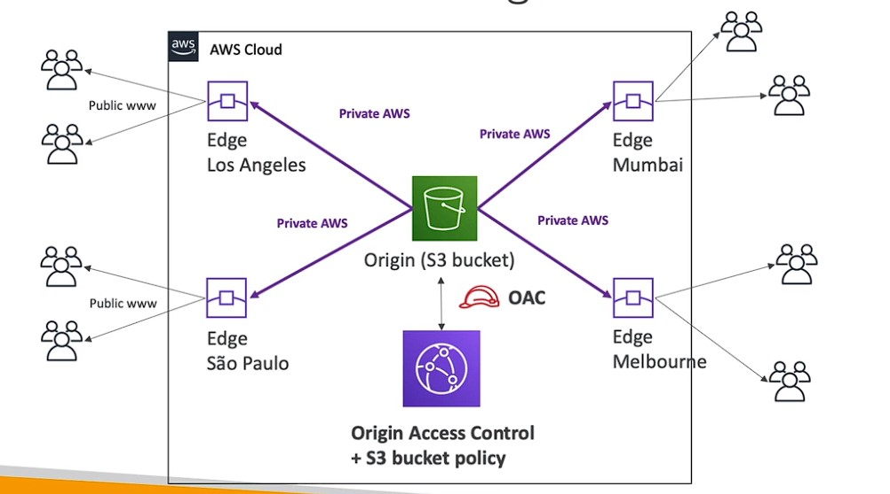
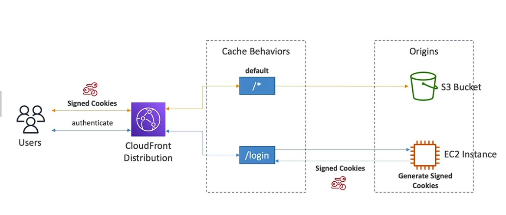
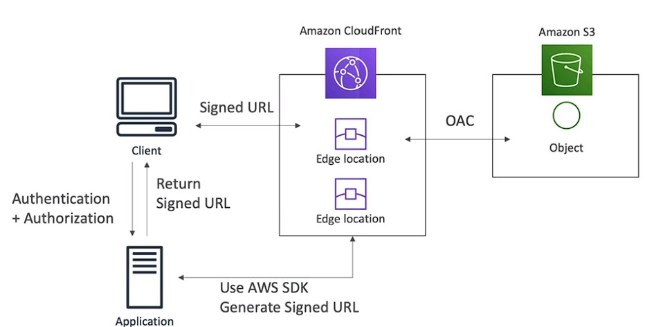
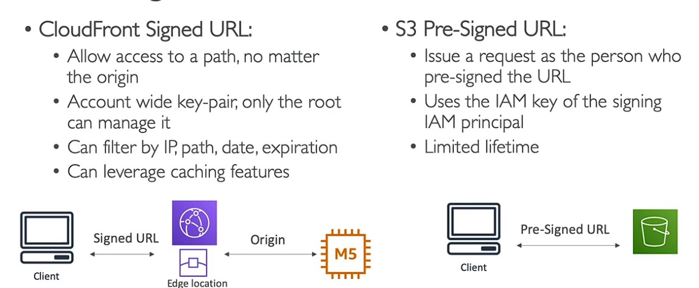

## AWS Cloud front is a Content Delivery Network (CDN) service

* Improves read performance, content is cached at the edge
* Improves users experience
* 216 Point of Presence globally (edge locations)
* DDoS protection (because worldwide), integration with Shield, AWS Web Application Firewall
* 

CloudFront — Origins

* S3 bucket
  * For distributing files and caching them at the edge
  * Enhanced security with CloudFront Origin Access Control (OAC)
  * OAC is replacing Origin Access Identity (OAI)
  * CloudFront can be used as an ingress (to upload files to S3)
   
  

* Custom origin (HTTP)
  * Application Load Balancer
  * EC2 instance
  * S3 website (must first enable the bucket as a static S3 website)
  * Any HTTP backend you want

* Its a global cache If a request is made from a particular region say usa to read data for australia the usa edge location sever makes the request to the origin server and store the data in cache in usa edge server so it that will be available in usa edge locaion if other similar request is made

CloudFront vs S3 Cross Region Replication
* CloudFront:
  * Global Edge network
  * Files are cached for a TTL (maybe a day)
  * Great for static content that must be available everywhere
* S3 Cross Region Replication:
  * Must be setup for each region you want replication to happen
  * Files are updated in near real-time
  * Read only
  * Great for dynamic content that needs to be available at low-latency in few regions

### CloudFront — Cache Invalidations
* In case you update the back-end origin, CloudFront doesn't know about it and will only get the refreshed content after the TTL has expired
* However, you can force an entire or partial cache refresh (thus bypassing the TTL) by performing a CloudFront Invalidation
* You can invalidate all files (*) or a special path (/images/*)

### CloudFront — Cache Behaviors
* Configure different settings for a given URL pathpattern
* Example: one specific cache behaviorto images/*.jpgfiles on your origin web server
* Route to different kind of origins/origin groupsbased on the content type or path pattern
  * for /images/* go to ec2 instance 
  * for /api/* go to load balancer
  * for /* (default cache behavior) go to s3 bucker
* When adding additional Cache Behaviors, the Default Cache Behavior is always the last to be processed and is always /* 
* example cache behaviors for sign in page
* 

### CloudFront Signed URL / Signed Cookies
* You want to distribute paid shared content to premium users over the world
* We can use CloudFront Signed URL / Cookie.We attach a policy with:
* Includes URL expiration
* Includes IP ranges to access the data from
* Trusted signers (which AWS accounts can create signed URLs)
* How long should the URL be valid for?
* Shared content (movie, music): make it short (a few minutes)
* Private content (private to the user): you can make it last for years
* Signed URL = access to individual files (one signed URL per file)
* 

* 

### Cloudfront signed url process
* Two types of signers:
  * Either a trusted key group (recommended)
    * Can leverage APIs to create and rotate keys (and IAM for API security)
  * An AWS Account that contains a CloudFront Key Pair
    * Need to manage keys using the root account and the AWS console
    * Not recommended because you shouldn't use the root account for this
* In your CloudFront distribution, create one or more trusted key groups
* You generate your own public / private key
  * The private key is used by your applications (e.g. EC2) to sign URLs
  * The public key (uploaded) is used by CloudFront to verify URLs