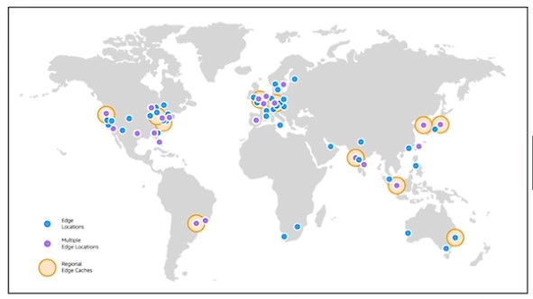
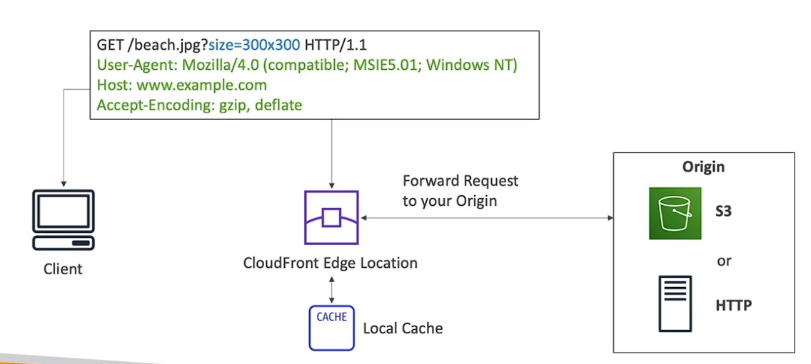
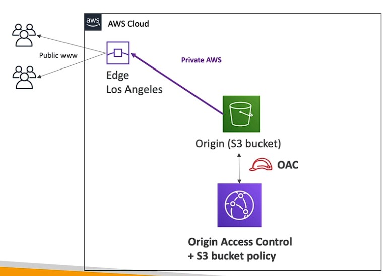

##  Content Delivery Network (CDN)

* Improves read performance, content is cached at the edge
* Improves users experience
* 21 6 Point of Presence globally (edge locations)
* DDoS protection (because worldwide), integration with Shield, AWS Web Application Firewall
* 

CloudFront — Origins
* S3 bucket
  * For distributing files and caching them at the edge
  * Enhanced security with CloudFront Origin Access Control (OAC)
  * OAC is replacing Origin Access Identity (OAI)
  * CloudFront can be used as an ingress (to upload files to S3)
* Custom origin (HTTP)
  * Application Load Balancer
  * EC2 instance
  * S3 website (must first enable the bucket as a static S3 website)
  * Any HTTP backend you want

CloudFront vs S3 Cross Region Replication
* CloudFront:
  * Global Edge network
  * Files are cached for a TTL (maybe a day)
  * Great for static content that must be available everywhere
* S3 Cross Region Replication:
  * Must be setup for each region you want replication to happen
  * Files are updated in near real-time
  * Read only
  * Great for dynamic content that needs to be available at low-latency in few regions