# Developer problems on AWS
* Managing infrastructure
* Deploying Code
* Configuring all the databases, load balancers, etc
* Scaling concerns
* Most web apps have the same architecture (ALB + ASG)
* All the developers want is for their code to run!
* Possibly, consistently across different applications and environments
* Beanstalk uses the cloud formation to deploy the resoure

## Elastic Beanstalk — Overview
* Elastic Beanstalk is a developer centric view of deploying an application
on AWS
* It uses all the component's we've seen before: EC2,ASG, ELB, RDS, *
* Managed service
* Automatically handles capacity provisioning, load balancing, scaling, application
health monitoring, instance configuration, ***
* Just the application code is the responsibility of the developer
* We still have full control over the configuration
* Beanstalk is free but you pay for the underlying instances 
* Elastic Beanstalk — Components
    * Application: collection of Elastic Beanstalk components (environments,
    versions, configurations, *** )
    * Application Version: an iteration of your application code
    * Environment
    * Collection of AWS resources running an application version (only one application
    version at a time)
    * Tiers: Web Server Environment Tier & Worker Environment Tier
    * You can create multiple environments (dev, test, prod, *** )

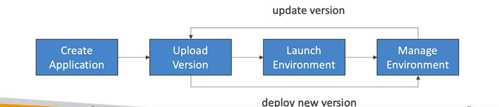

# Elastic Beanstalk Supported Platforms

* Go
* Java SE
* Java with Tomcat
* .NET Core on Linux
* .NET on Windows Server
* Node.js
* Python
* Ruby
* Packer Builder
* Single Container Docker
* Multi-container Docker
* Preconfigured Docker
* If not supported, you can write your custom platform (advanced)

 

 

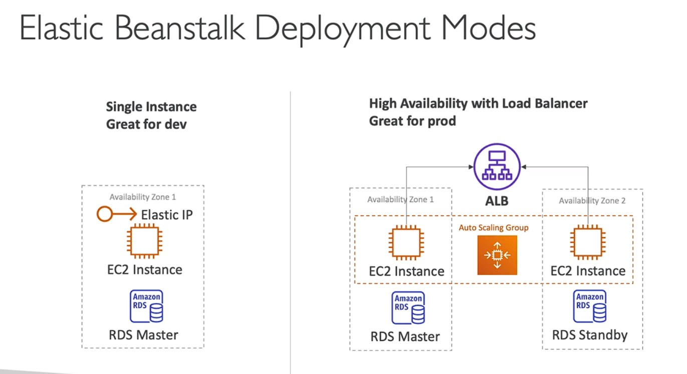
 

 

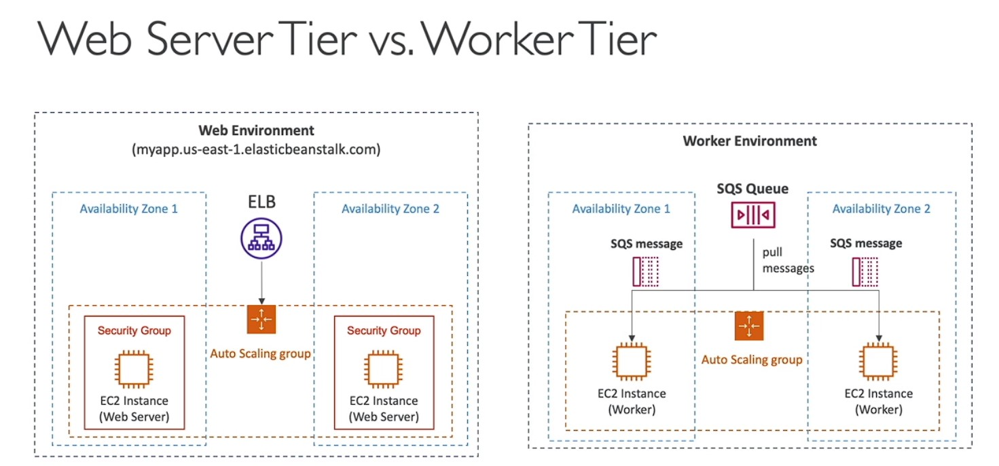   

## Beanstalk Deployment Options for Updates
* All at once (deploy all in one go) — fastest, but instances aren't available to serve traffic for a bit (downtime)
  * Fastest deployment
  * Application has downtime
  * Great for quick iterations in development environment
  * No additional cost
  * 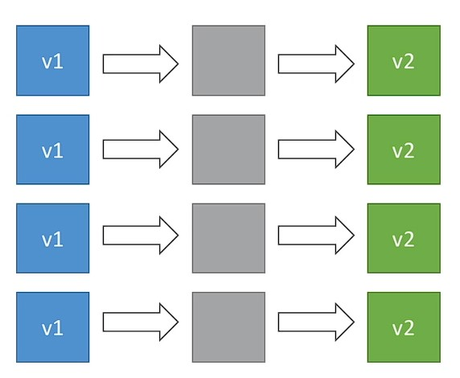

 

* **Rolling**: update a few instances at a time (bucket), and then move onto the next bucket once the first bucket is healthy
  * Application is running below capacity
  * Can set the bucket size
  * Application is running both versions simultaneously
  * No additional cost
  * Long deployment if there are large number of instance
  * 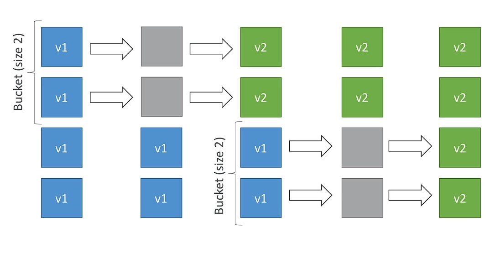
 

* **Rolling with additional batches**: like rolling, but spins up new instances to move the batch (so that the old application is still available)
    * Application is running at capacity
    * Can set the bucket size
    * Application is running both versions simultaneously
    * Small additional cost
    * Additional batch is removed at the end of the deployment
    * Longer deployment
    * Good for prod 
    * 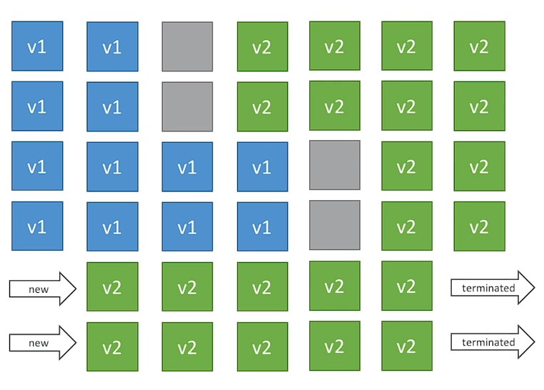

* **Immutable**: spins up new instances in a new ASG, deploys version to these instances, and then swaps all the instances when everything is healthy
    * Zero downtime
    * New Code is deployed to new instances on a temporary ASG
    * High cost, double capacity
    * Longest deployment
    * Quick rollback in case of failures (just terminate new ASG)
    * Great for prod
    * 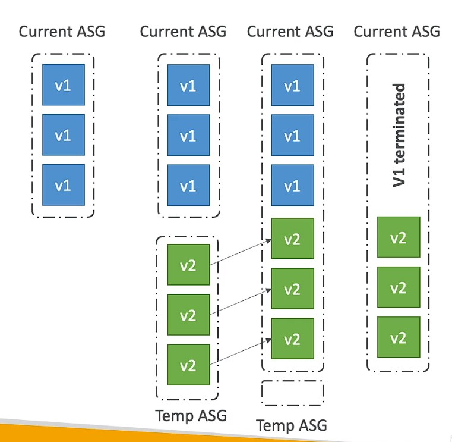

* **Blue Green**: create a new environment and switch over when ready
  *  Not a "direct feature" of Elastic Beanstalk
  * Zero downtime and release facility
  * Create a new "stage" environment anddeploy v2 there
  * The new environment (green) can be validated independently and roll back if issues
  * Route 53 can be setup using weighted policies to redirect a little bit of traffic to the stage environment
  * Using Beanstalk, "swap URLs" when donewith the environment test
    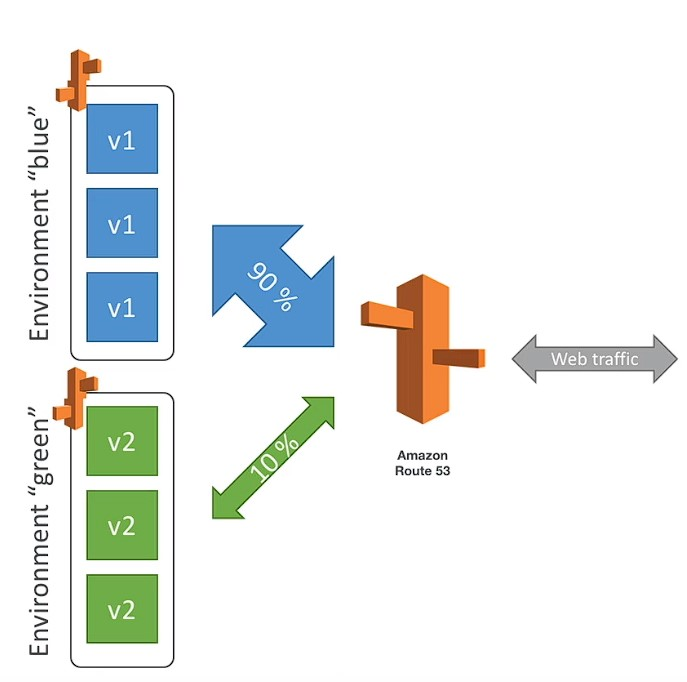

* Traffic Splitting. **canary testing** — send a small % of traffic to new deployment
  * **Canary Testing**
    * New application version is deployed to a temporary ASG with the same capacity
    * A small % of traffic is sent to the temporary ASG for a configurable amount of time
    * Deployment health is monitored
    * If there's a deployment failure, this triggers an automated rollback (very quick)
    * No application downtime
    * New instances are migrated from the temporary to the original ASG
    * Old application version is then terminated
    * 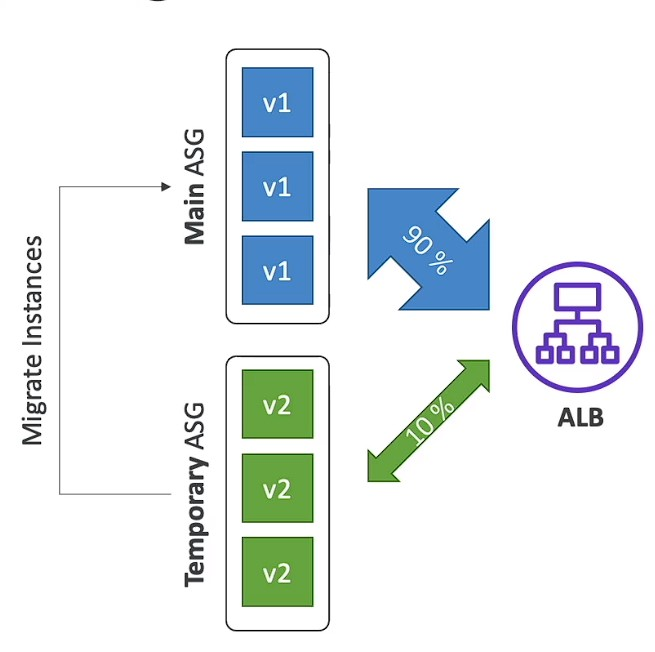

 

 

### SUMMARY

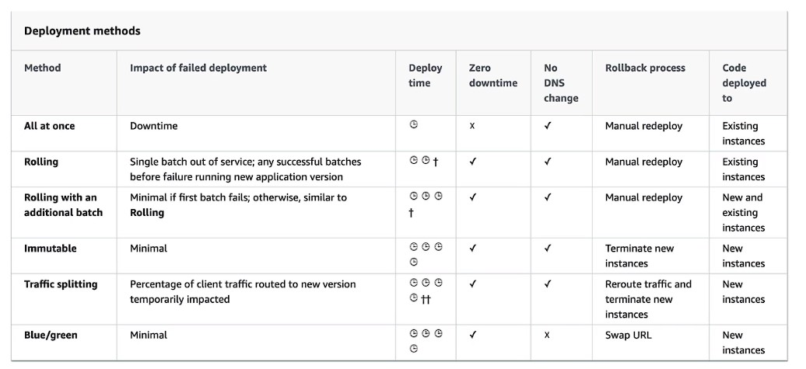

## Elastic Beanstalk CLI
* We can install an additional CLI called the "EB cli" which makes working with
Beanstalk from the CLI easier
* Basic commands are:
    * eb create
    * eb status
    * eb health
    * events
    * eb logs
    * eb open
    * eb deploy
    * eb config
    * eb terminate
* It's helpful for your automated deployment pipelines!

## Elastic Beanstalk Deployment Process
* Describe dependencies (requirements.txt for Python, package.json for Node.js)
* Package code as zip, and describe dependencies 
  * Python: requirements.txt
  * Node.js: package.json
* Console: upload zip file (creates new app version), and then deploy
* CLI: create new app version using CLI (uploads zip), and then deploy
* Elastic Beanstalk will deploy the zip on each EC2 instance, resolve dependencies and start the application

## Beanstalk Lifecycle Policy
* Elastic Beanstalk can store at most 1000 application versions
* If you don't remove old versions, you won't be able to deploy anymore
* To phase out old application versions, use a lifecycle policy
* Based on time (old versions are removed)
* Based on space (when you have too many versions)
* Versions that are currently used won't be deleted
* Option not to delete the source bundle in S3 to prevent data loss

## Elastic Beanstalk Extensions
* A zip file containing our code must be deployed to Elastic Beanstalk
* All the parameters set in the UI can be configured with code using files
* Requirements:
    * in the .ebextensions/ directory in the root of source code
    * YAML / JSON format
    * .config extensions (example: logging.config)
* Able to modify some default settings using: option_settings
* Ability to add resources such as RDS, ElastiCache, DynamoDB, etc. ..
* Resources managed by .ebextensions get deleted if the environment goes away

## Elastic Beanstalk Cloning
* Clone an environment with the exact same configuration
* Useful for deploying a 'test" version of your application
* All resources and configuration are preserved:
* Load Balancer type and configuration
* RDS database type (but the data is not preserved)
* Environment variables
* After cloning an environment, you can change settings

## EB Migration
* To update CLB to ALB
  * After creating an Elastic Beanstalk environment, you cannot change the Elastic Load Balancer type (only the configuration)
  * To migrate:
    1. create a new environment with the same configuration except LB (can't clone)
    2. deploy your application onto the new environment
    3. perform a CNAME swap or Route 53 update

* RDS can be provisioned with Beanstalk, which is great for dev / test
  * This is not great for prod as the database lifecycle is tied to the Beanstalk environment lifecycle
  * The best for prod is to separately create an RDS database and provide our EB application with the connection string 
    * How to decocuple
        * Create a snapshot of RDS DB (as a safeguard)
        * Go to the RDS console and protect the RDS database from deletion
        * Create a new Elastic Beanstalk environment, without RDS, point your application to existing RDS
        * perform a CNAME swap (blue/green) or Route 53 update, confirm working
        * Terminate the old environment (RDS won't be deleted)
        * Delete CloudFormation stack (in DELETE_FAILED state)

 *  |                                      |                                          |
    | ------------------------------------ | ---------------------------------------- |
    | 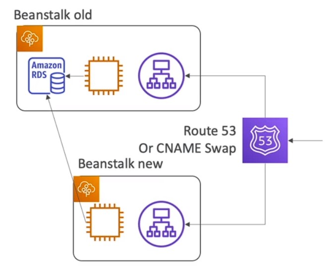 | 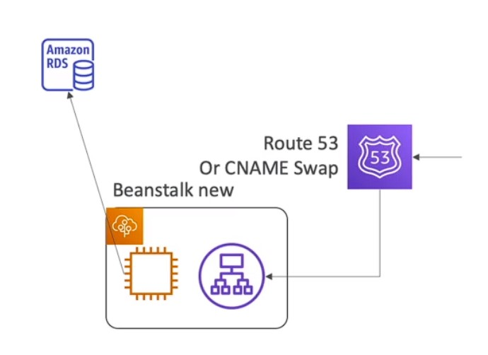 |