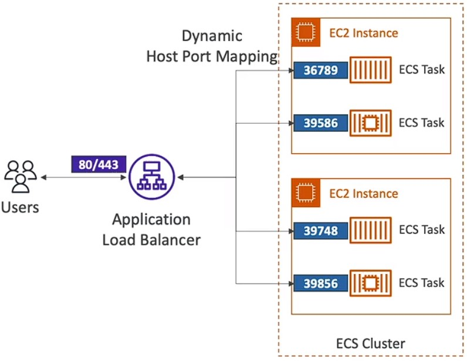
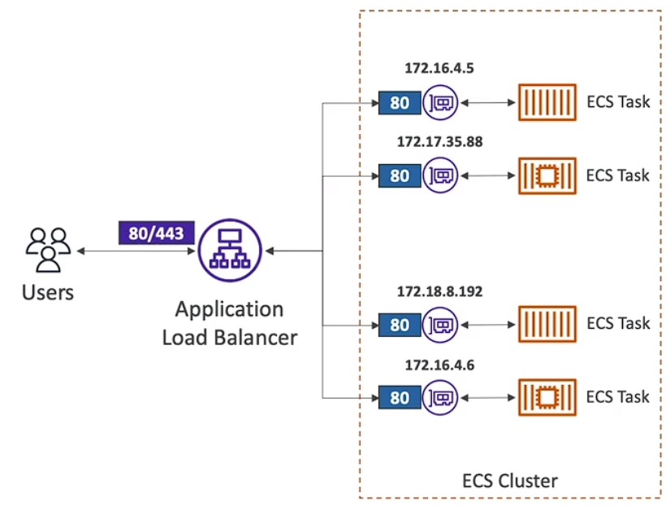
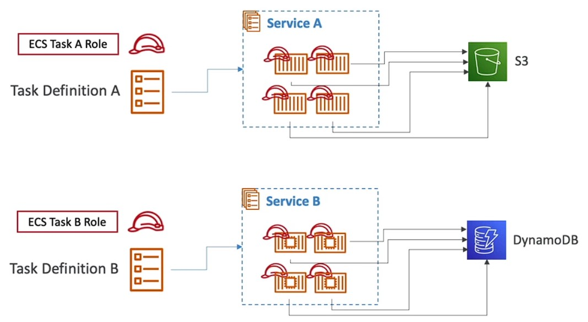
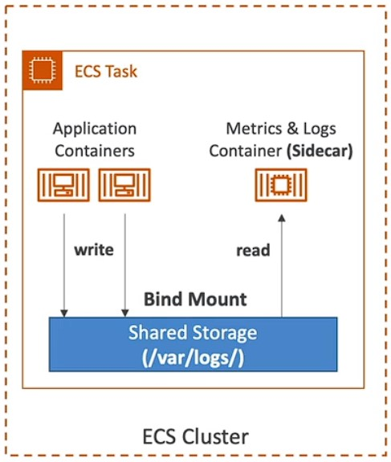
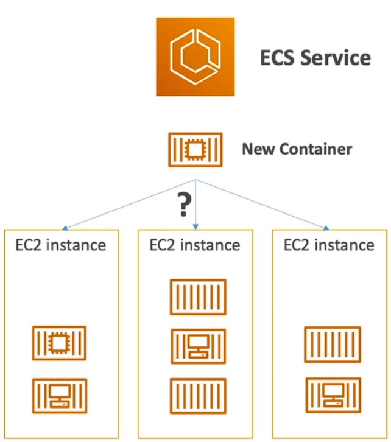
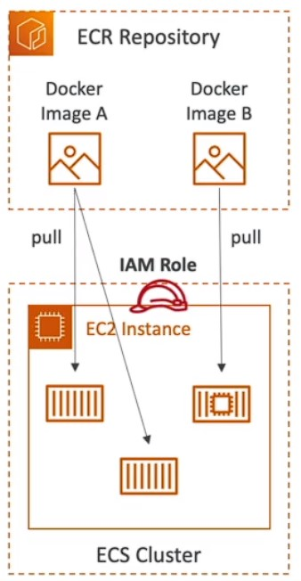
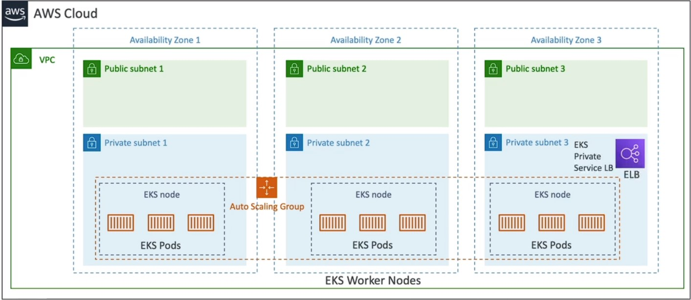
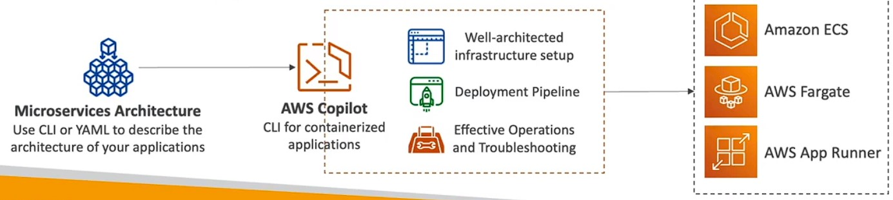

## Amazon ECS 
there are two types of services that aws offers  i.e EC2 lanch type and ECS Fargate
### EC2 lanch type
where you manually provicsion the servers for containers to run using docker ecs agent
### ECS Fargate
Its severless where aws takes care of infra you need to define the tasks to run on containers

### Amazon ECS —Task Definitions

- Task definitions are metadata in JSON form to tell ECS how to run a Docker container
- It contains crucial information, such as: Image Name
  - Port Binding for Container and Host
  - Memory and CPU required
  - Environment variables
  - Networking information
  - IAM Role
  - Logging configuration (ex CloudWatch)

### ECS - Load balancing - EC2 type - Dynamic Host port mapping

- We get a Dynamic Host Port Mapping if you define only the container port in the task definition
- The ALB finds the right port on your EC2 Instances
- You must allow on the EC2 instance's Security Group any port from the ALB's Security Group
- 

### ECS - Load balancing - EC2 Fargate

- Each task has a unique private IP
- Only define the container port (host port is not applicable)
- Example
  -   ECS ENI Security Group
      - Allow port 80 from the ALB
  -   ALB Security Group
      - Allow port 80/443 from web
- 

## Amazon ECS allowd only One IAM Role per Task Definition

- 

### Amazon ECS — Environment Variables
- Environment Variable
  - Hardcoded — e.g., URLs
  - SSM Parameter Store — sensitive variables (e.g., API keys, shared configs)
  - Secrets Manager — sensitive variables (e.g., DB passwords)
- Environment Files (bulk) —Amazon S3

### Amazon ECS — Data Volumes (Bind Mounts)

- Share data between multiple containers in the same Task Definition
- Works for both EC2 and Fargate tasks
- EC2Tasks — using EC2 instance storage
  - Data are tied to the lifecycle of the EC2 instance
- FargateTasks — using ephemeral storage
  - Data are tied to the container(s) using them
  - 20 - 200 GiB (default 20 GiB)
- Use cases:
  - Share ephemeral data between multiple containers
  - "Sidecar" container pattern, where the "sidecar" container used to send metrics/logs to other destinations (separation of conems)
- 

### ECS Tasks Placement
- When a task of type EC2 is launched, ECS must determine where to place it, with the constraints of CPU, memory, and available port.
- Similarly, when a service scales in, ECS needs to determine which task to terminate.
- To assist with this, you can define a task placement strategy and task placement constraints
- Note: this is only for ECS with EC2, not for Fargate
  
- 
  
- Task placements process:
  - Task placement strategies are a best effort
  - When Amazon ECS places tasks, it uses the following process to select
container instances:

    1. Identify the instances that satisfy the CPU, memory, and port requirements in the task definition.
    2. Identify the instances that satisfy the task placement constraints.
    3. Identify the instances that satisfy the task placement strategies.
    4. Select the instances for task placement. 
- Ecs task stragies
  - Binpack
    - Place tasks based on the least available amount of CPU or memory
    - This minimizes the number of instances in use (cost savings)
  -  Random
     -  places randomly
  - Spread
    - - Place the task evenly based on the specified value
    - Example: instanceld,attribute:ecs.availability-zone
### Yo you can mix and match 

### ECS Task Placement Constraints

- distinctlnstance: place each task on a different container instance
- memberOf: places task on instances that satisfy an expression
  - Uses the Cluster Query Language (advanced)

### ECR 
Amazon ECR
- ECR = Elastic Container Registry
- Store and manage Docker images on AWS
- Private and Public repository (Amazon ECR Public Gallery https://gallery.ecr.aws)
- Fully integrated with ECS, backed by Amazon S3
- Access is controlled through IAM (permission errors => policy)
- Supports image vulnerability scanning, versioning, image tags, image lifecycle, .

- 

### EKS

Amazon EKS Overview
- Amazon EKS = Amazon Elastic Kubernetes Service
- It is a way to launch managed Kubernetes clusters on AWS
- Kubernetes is an open-source system for automatic deployment, scaling anc management of containerized (usually Docker) application
- It's an alternative to ECS, similar goal but different API
- EKS supports EC2 ifyou want to to deploy worker nodes or Fargate to deploy serverless containers
- Use case: if your company is already using Kubernetes on-premises or in another cloud, and wants to migrate to AWS using Kubernetes
- Kubemetes is cloud-agnostic (can be used in any cloud — Azure, GCP... )
- 

### Amazon EKS — Node Types
- Managed Node Groups
  - Creates and manages Nodes (EC2 instances) for you
  - Nodes are part of an ASG managed by EKS
  - Supports On-Demand or Spot Instances
- Self-Managed Nodes
  - Nodes created by you and registered to the EKS cluster and managed by an ASG
  - You can use prebuilt AMI - Amazon EKS Optimized AMI
  - Supports On-Demand or Spot Instances
- AWS Fargate
  - No maintenance required; no nodes managed
  - 
### Amazon EKS — Data Volumes
- Need to specify StorageClass manifest on your EKS cluster
- Leverages a Container Storage Interface (CSI) compliant driver
- Support for. ..
  - Amazon EBS
  - Amazon EFS (works with Fargate)
  - Amazon FSx for Lustre
  - Amazon FSx for NetApp ON TAP

### AWS Copilot
- CLI tool to build, release, and operate production-ready containerized apps
- Run your apps on AppRunner, ECS, and Fargate
- Helps you focus on building apps rather than setting up infrastructure
- Provisions all required infrastructure for containerized apps (ECS,VPC, ELB, ECR... )
- Automated deployments with one command using CodePipeline
- Deploy to multiple environments
- Troubleshooting, logs, health status. ..
- 