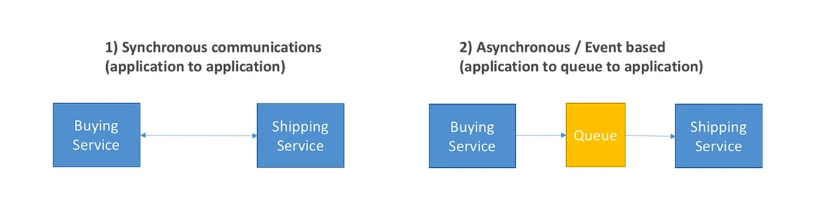
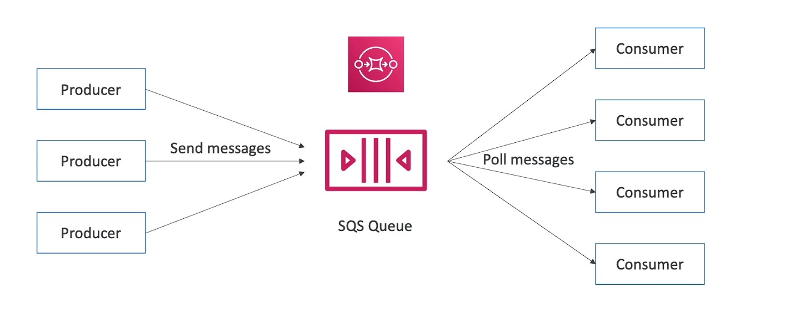
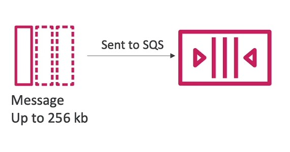
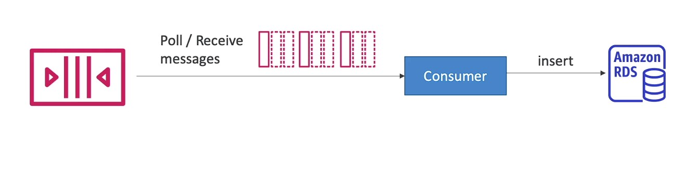
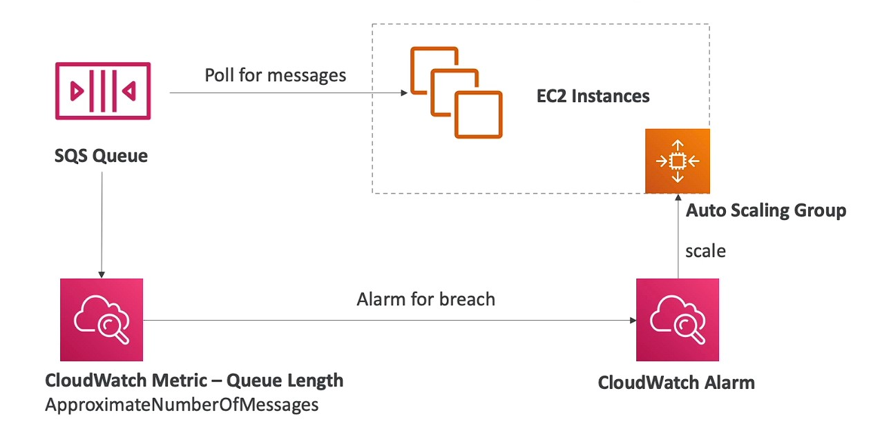
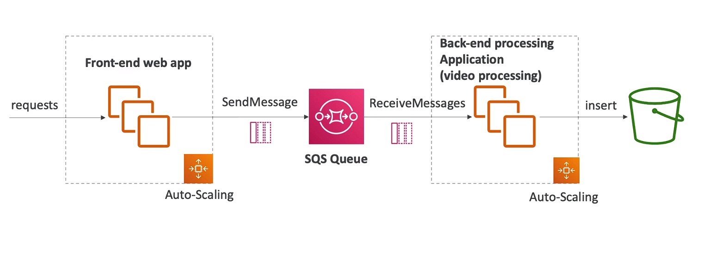

 # Integration and messaging service

 ## SQS

* When we start deploying multiple applications, they will inevitably need to communicate with one another
* There are two patterns of application communication 

* Synchronous between applications can be problematic if there are
sudden spikes of traffic
* What if you need to suddenly encode 1000 videos but usually it's 10?
* In that case, it's better to decouple your applications,
    * using SQS: **queue** model
    * using SNS: **pub/sub** model
    * using Kinesis: real-time streaming model

* these service scale independently base on application

## What is a Queue ?

* SQS acts as buffer to decouple b/w the producer and consumer

## Amazon SQS — Standard Queue
* Oldest offering (over 10 years old)
* Fully managed service, used to decouple applications
* Attributes:
  * Unlimited throughput, unlimited number of messages in queue
  * Default **retention** of messages: *4 days*, *maximum of 14 days*
* Low latency (< 10 ms on publish and receive)
* Limitation of **256KB** per message sent
* Can have duplicate messages (at least once delivery, occasionally)
* Can have out of order messages (best effort ordering)

## SQS — Producing Messages
* Produced to SQS using the SDK (SendMessage API)
* The message is persisted in SQS until a consumer deletes it
* Message retention: default 4 days, up to 14 days
  * Example: send an order to be processed
    * Order id
    * Customer id
* Any attributes you want
* SQS standard: unlimited throughput

## SQS — Consuming Messages
* Consumers (running on EC2 instances, servers, or AWS Lambda)...
* Poll SQS for messages (receive up to IO messages at a time)
* Process the messages (example: insert the message into an RDS database)
* Delete the messages using the DeleteMessage API

## sqs multiple ec2 comsumer

* Consumers receive and process messages in parallel
* At least once delivery
* Best-effort message ordering
* Consumers delete messages after processing them
* We can scale consumers horizontally to improve throughput of processing

## Amazon SQS - Security
* Encryption:
* In-flight encryption using HTTPS API
* At-rest encryption using KMS keys
* Client-side encryption if the client wants to perform encryption/decryption itself
* Access Controls: IAM policies to regulate access to the SQS API
* SQS Access Policies (similar to S3 bucket policies)
* Useful for cross-account access to SQS queues
* Useful for allowing other services (SNS, S3... ) to write to an SQS queue