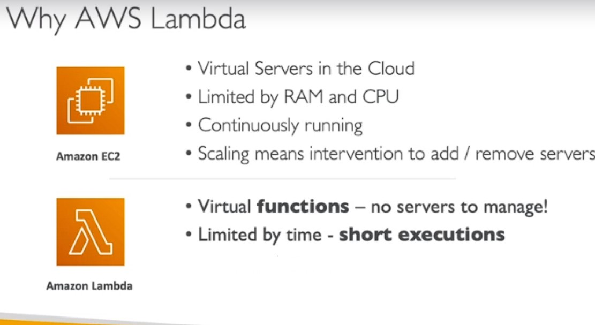
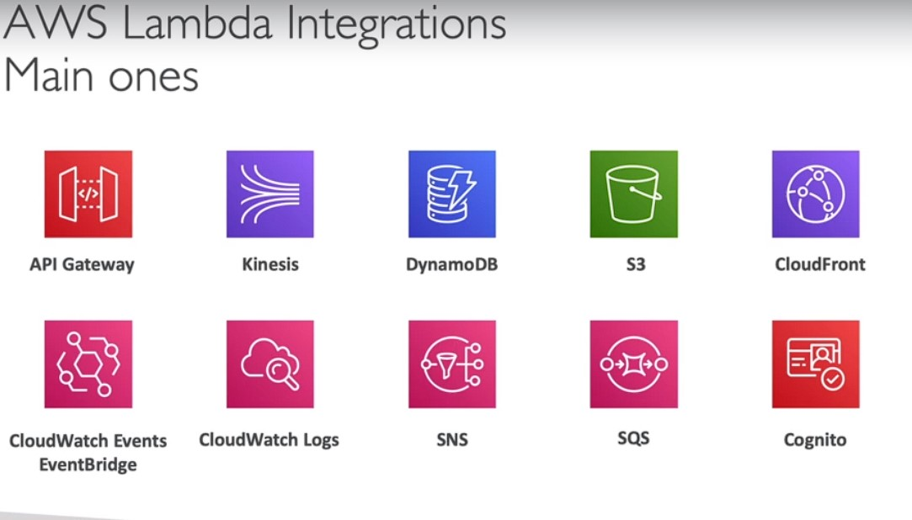
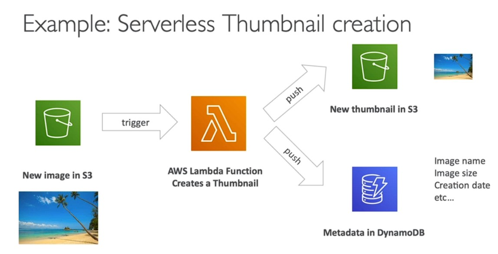

# Serverless 
You dont need to manage any server, ready to use functions, like AWS LAMBA

- Initially it was called Funciton as a service FaaS
-  AWS Lambda was the pioneer for serverless
-  They just deploy functions
-  Ability to scale up/down based on traffic

# Serverless in AWS

- AWS Lambda
- DynamoDB
- AWS Cognito
- AWS API Gateway
- Amazon S3
- AWS SNS & SQS
- AWS Kinesis Data Firehose
- Aurora Servedess
- Step Functions
- Fargate

# Why Lambda

- Integrated with the whole AWS suite of services
- Integrated with many programming languages
- Easy monitoring through AWS CloudWatch
- Easy to get more resources per functions (up to I OGB of RAM!)
- Increasing RAM will also improve CPU and network!



## Lambda Container Image

- The container image must implement the Lambda Runtime API
- ECS / Fargate is preferred for running arbitrary Docker images


## Lambda Integraion





- To preform severless CRON job using event scheduler

## Synchronous Invocaitons

- Synchronous: CLI,SDK, API Gateway, Applicaion Load Balancer
  - Results are returned right aws
  - Error handeling must happem clinet side (retries, exponential backoff, etc)


- User invoked:
 -  Elastic Load Balancing (Application Load Balancer)
 -  Amazon API Gateway
 -  Amazon CloudFront (Lambda@Edge)
 -  Amazon S3 Batch
  
- service Invoked:
  - Amazon Cognito
  - AWS Step Functions
  
- Other Services:
  - Amazon Lex
  - Amazon Alexa 
  - Amazon Kinesis Data Firehose


```py
def lambda_handler(event, context):
    return {
        'status code': 200,
        'body': json.dumps('Hello form Lambda!')
    }
```

```
{
  'requestContext': 
          {'elb': {'targetGroupArn': 'arn:aws:elasticloadbalancing:us-east-1:328268088738:targetgroup/alb-lambda-mule/bcc69a614ccfa457'}},
          'httpMethod': 'GET',
          'path': '/',
          'queryStringParameters': {},
          'headers': {'user-agent': 'ELB-HealthChecker/2.0'},
          'body': '', 
          'isBase64Encoded': False
}

```

```py
import json

def lambda_handler(event, context):
    return {
        "statusCode": 200,
        "statusDescription": "200 OK",
        "isBase64Encoded": False,
        "headers": {
            "Content-Type": "text/html"
        },
        "body": "<h1>Hello from Lambda!</h1>"
    }

```

```json
return {
        "statusCode": 200,
        "statusDescription": "200 OK",
        "isBase64Encoded": False,
        "headers": {
            "Content-Type": "text/html"
        },
        "body": "<h1>Hello from Lambda!</h1>"
    }
```
