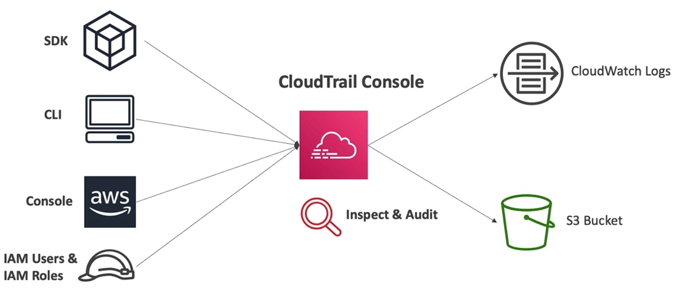

## AWS CloudTrail
* Provides governance, compliance and audit for your AWS Account
* CloudTrail is enabled by default!
* Get an history of events / API calls made within your AWS Account by:
  * Console
  * SDK
  * CLI
  * AWS Services
* Can put logs from CloudTrail into CloudWatch Logs or S3
* **A trail can be applied to All Regions (default) or a single Region.**
* If a resource is deleted in AWS, investigate CloudTrail first!

## CloudTrail Events

* Types Events that can be monitored bt cloud trail
    * Management Events: Operations that are performed on resources in your AWS account
      * Examples:
        * Configuring security (IAM AttachRoIePoIicy)
        * Configuring rules for routing data (Amazon EC2 CreateSubnet)
        * Setting up logging (AWS CloudTrail CreateTrai1)
        * By default, trails are configured to log management events
        * Can separate Read Events (that don't modify resources) from Write Events (that may modify resources)
    * Data Events:
        * By default, data events are not logged (because high volume operations)
          * Example
            * Amazon S3 object-level activity (ex: GetObject. DeleteObject, PutObject): can separate Read and Write Events
            * AWS Lambda function execution activity (the Invoke API)
            * CloudTrail Insights Events:
    * CloudTrail Insights
        * Enable CloudTrail Insights to detect unusual activity in your account:
        * inaccurate resource provisioning
        * hitting service limits
        * Bursts of AWS IAM actions
        * Gaps in periodic maintenance activity
        * CloudTrail Insights analyzes normal management events to create a baseline
        * And then continuously analyzes write events to detect unusual patterns
        * Anomalies appear in the CloudTrail console

## CloudTrail Events Retention

* Events are stored for 90 days in CloudTrail
* To keep events beyond this period, log them to S3 and use Athena