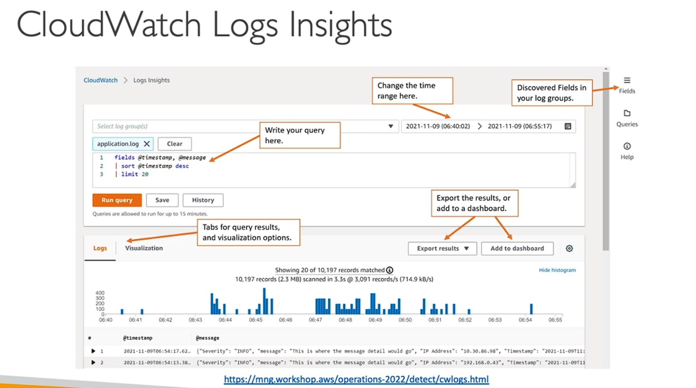

# AWS CloudWatch Metrics
* CloudWatch provides metrics for every services in AWS
* Metric is a variable to monitor (CPUUtilization, Networkln... )
* Metrics belong to namespaces( ALB, EC2 as a whole)
* Dimension is an attribute of a metric (instance id, environment, etc.. .).
* Up to 30 dimensions per metric
* Metrics have timestamps
* Can create CloudWatch dashboards of metrics

## EC2 Detailed monitoring
* EC2 instance metrics have metrics "every 5 minutes"
* With detailed monitoring (for a cost), you get data "every I minute"
* Use detailed monitoring if you want to scale faster for your ASG!
* The AWS Free Tier allows us to have IO detailed monitoring metrics
* Note: EC2 Memory usage is by default not pushed (must be pushed
from inside the instance as a custom metric)

## CloudWatch Custom Metrics
* Possibility to define and send your own custom metrics to CloudWatch
* Example: memory (RAM) usage, disk space, number of logged in users ...
* Use API call PutMetricData
* Ability to use dimensions (attributes) to segment metrics
* Instance.id
* Environment.name
* Metric resolution (StorageResolution API parameter — two possible value):
* Standard: I minute (60 seconds)
* High Resolution: 1/5/ 1 0/30 second(s) — Higher cost
* Important: Accepts metric data points two weeks in the past and two hours in the
future (make sure to configure your EC2 instance time correctly)

##CloudWatch Logs
* Log groups: arbitrary name, usually representing an application
* Log stream: instances within application / log files / containers
* Can define log expiration policies (never expire, I day to IO years... )
* CloudWatch Logs can send logs to:
* Amazon S3 (exports)
* Kinesis Data Streams
* Kinesis Data Firehose
* AWS Lambda
* OpenSearch
* Logs are encrypted by default
* Can setup KMS-based encryption with your own keys

## CloudWatch Logs - Sources
* SDK, CloudWatch Logs Agent, CloudWatch Unified Agent
* Elastic Beanstalk: collection of logs from application
* ECS: collection from containers
* AWS Lambda: collection from function logs
* VPC Flow Logs:VPC specific logs
* API Gateway
* CloudTrail based on filter
* Route53: Log DNS queries

## CloudWatch Logs Insights

* Search and analyze log data stored in CloudWatch Logs
* Example: find a specific IP inside a log, count occurrences of
"ERROR" in your logs...
* Provides a purpose-built query language
* Automatically discovers fields from AWS services and JSON log
events
* Fetch desired event fields, filter based on conditions, calculate
aggregate statistics, sort events, limit number of events...
* Can save queries and add them to CloudWatch Dashboards
Can query multiple Log Groups in different AWS accounts
* It's a query engine, not a real-time engine

## CloudWatch Logs-S3 Export
* Log data can take upto 12 hours to
become available for export
* The API call is CreateExportTask
* Not near-real time or real-time... use
Logs Subscriptions instead

## CloudWatch Logs Subscriptions
* Get a real-time log events from CloudWatch Logs for processing and analysis
* Send to Kinesis Data Streams, Kinesis Data Firehose, or Lambda
* Subscription Filter — filter which logs are events delivered to your destination