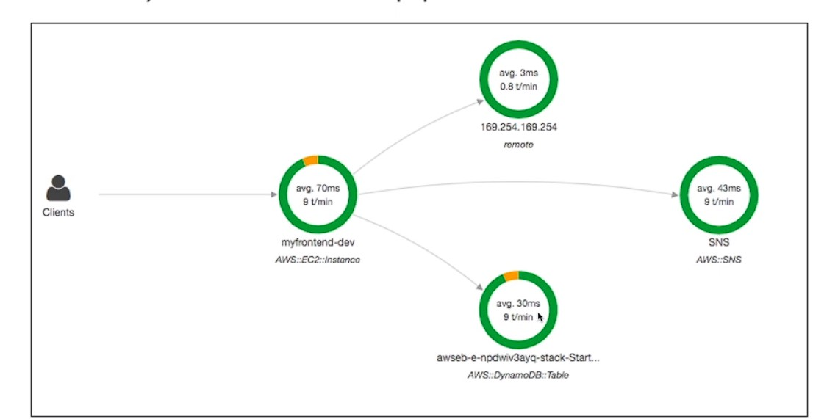
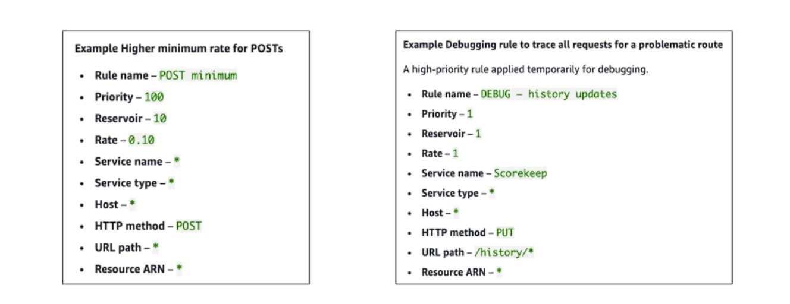

# AWS X-Ray

* Debugging in Production, the good old way:
* Test locally
* Add log statements everywhere
* Re-deploy in production
* Log formats differ across applications using CloudWatch and analytics is
hard.
* Debugging: monolith "easy", distributed services "hard"
* No common views of your entire architecture!

# Enter. .. AWS X-Ray! - A visual analysis of our applicaitons

## Open Telemetry is an open-source tracing tool where is x ray is aws only

## AWS Distro for Open Telemetry
* Secure, production-ready AWS-supported distribution of the open-source project Open Telemetry project
* Provides a single set of APIs, libraries, agents, and collector services
* Collects distributed traces and metrics from your apps
* Collects metadata from your AWS resources and services
* Auto-instrumentation Agents to collect traces without changing your code
* Send traces and metrics to multiple AWS services and partner solutions
* X-Ray, CloudWatch, Prometheus. ..
* Instrument your apps running on AWS (e.g., EC2, ECS, EKS, Fargate, Lambda) as well as on-premises
* Migrate from X-Ray to AWS Distro for Temeletry if you want to standardize with open-source APIs from Telemetry or send traces to multiple destinations simultaneously

### AWS X-Ray advantages
* Troubleshooting performance (bottlenecks)
* Understand dependencies in a microservice architecture
* Pinpoint service issues
* Review request behavior
* Find errors and exceptions
* Are we meeting time SLA?
* Where I am throttled?
* Identify which user are ffected

### X-Ray compatibility
* AWS Lambda
* Elastic Beanstalk
* ECS
* ELB
* API Gateway
* EC2 Instances or any application server (even on premise)

### AWS X-Ray Leverages Tracing
* Tracing is an end to end way to following a "request"
* Each component dealing with the request adds its own "trace"
* Tracing is made of segments (+ sub segments)
* Annotations can be added to traces to provide extra-information
* Ability to trace:
* Every request
* Sample request (as a % for example or a rate per minute)
* X-Ray Security:
* IAM for authorization
* KMS for encryption at rest 

## How to enable it?

*  Your code (java, Python, Go, Node.js, .NET) must import the AWS
x-Ray SDK
* Very little code modification needed
* The application SDK will then capture:
Calls to AWS services
. HTTP / HIT PS requests
* Database Calls (MySQL, PostgreSQL, DynamoDB)
* Queue calls (SQS)

*  **Install the X-Ray daemon or enable X-Ray AWS Integration**
*  **X-Ray daemon works as a low level UDP packet interceptor**
(Linux / Windows / Mac... )
* AWS Lambda / other AWS services already run the X-Ray daemon for you
* Each application must have the IAM rights to write data to X-Ray

## The X-Ray magic
* X-Ray service collects data from all the different services
* Service map is computed from all the segments and traces
* X-Ray is graphical, so even non technical people can help troubleshoot

## AWS X-RayTroubleshooting
* If X-Ray is not working on EC2
* Ensure the EC2 IAM Role has the proper permissions
* Ensure the EC2 instance is running the X-Ray Daemon
* To enable on AWS Lambda:
* Ensure it has an IAM execution role with proper policy
(AWSX-RayWriteOnlyAccess)
* Ensure that X-Ray is imported in the code
* Enable Lambda X-Ray Active Tracing

### X-Ray Concepts
* Segments: each application / service will send them
* Subsegments: if you need more details in your segment
* Trace: segments collected together to form an end-to-end trace
* Sampling: decrease the amount of requests sent to X-Ray, reduce cost
* Annotations: KeyValue pairs used to index traces and use with filters
* Metadata: KeyValue pairs, not indexed, not used for searching
* The X-Ray daemon / agent has a config to send traces cross account:
* make sure the IAM permissions are correct — the agent will assume the role
* This allows to have a central account for all your application tracing

### X-Ray Sampling Rules
* With sampling rules, you control the amount of data that you record
* You can modify sampling rules without changing your code
* By default, the X-Ray SDK records the first request each second, and five percent of any additional requests.
* One request per second is the reservoir, which ensures that at least one trace is recorded each second as long the service is serving requests.
* Five percent is the rate at which additional requests beyond the reservoir size are sampled.

###

* You can create you own rules with reservoir and rate

## X-Ray Write APIs (used by X-Ray daemon)

* PutTraceSegments: Uploads segment documents to AWS X-Ray
* PutTelemetryRecords: Used by the AWS
X-Ray daemon to upload telemetry.
* SegmentsReceivedCount,SegmentsRejectedCounts, BackendConnectionErrors...
* GetSamplingRules: Retrieve all sampling rules (to know what/when to send)
* GetSamplingTargets & GetSamplingStatlsticSummaries: advanced
* The X-Ray daemon needs to have an IAM policy authorizing the correct API calls to functlon correctly
 * GetServiceGraph: main graph
* BatchGetTraces: Retrieves a list of traces specified by ID. Each trace is a collection of segment documents that originates from a single request.
* GetTraceSummaries: Retrieves IDs and annotations for traces available for a specified time frame using an optional filter. To get the full traces, pass the trace IDs to BatchGetTraces.
* GetTraceGraph: Retrieves a service graph for one or more specific trace IDs