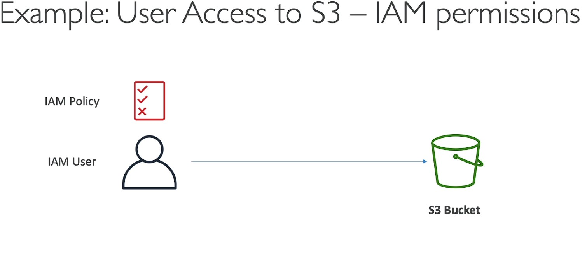
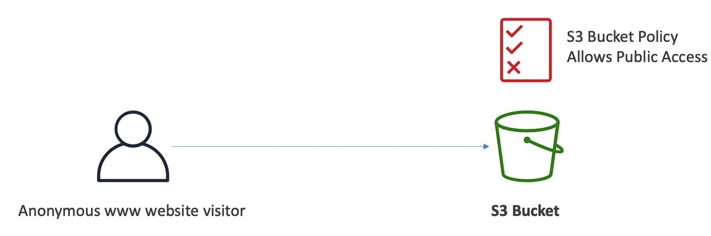
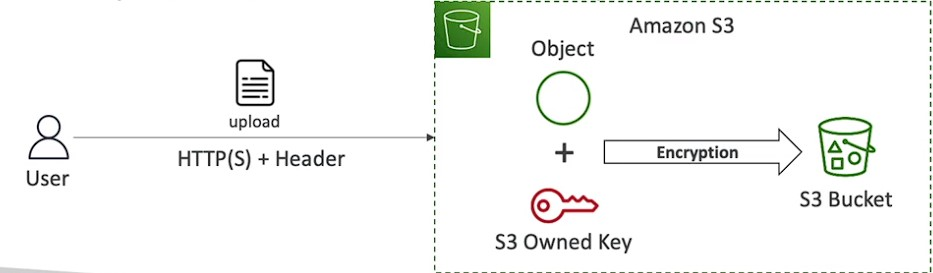
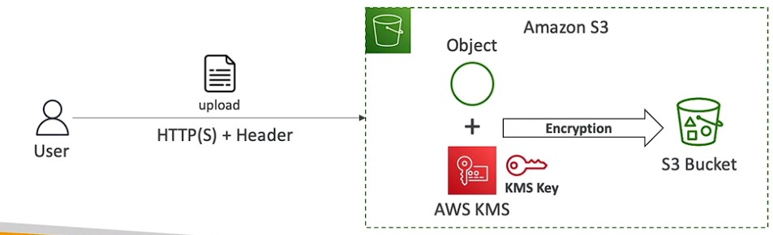
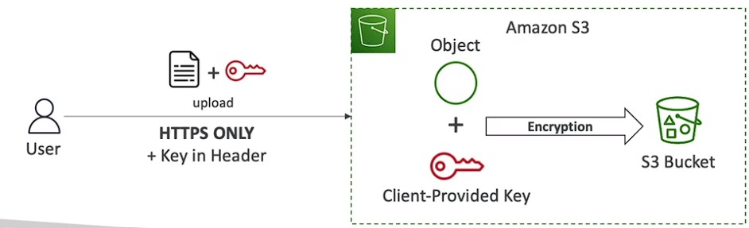
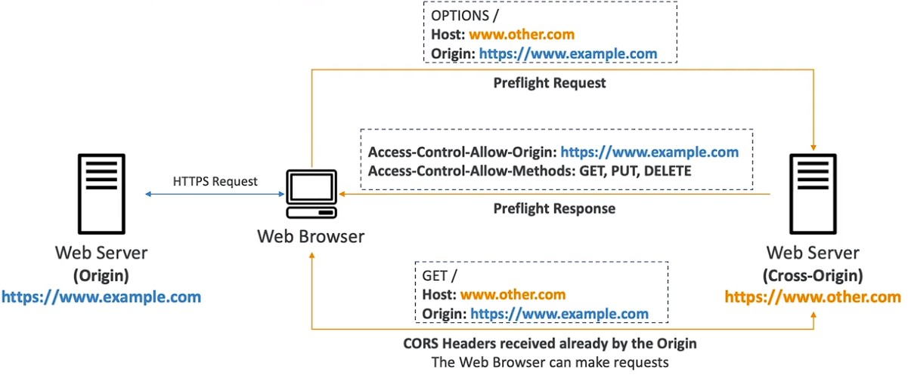
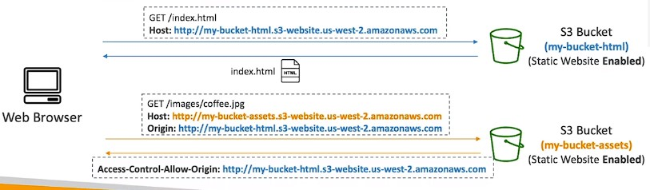
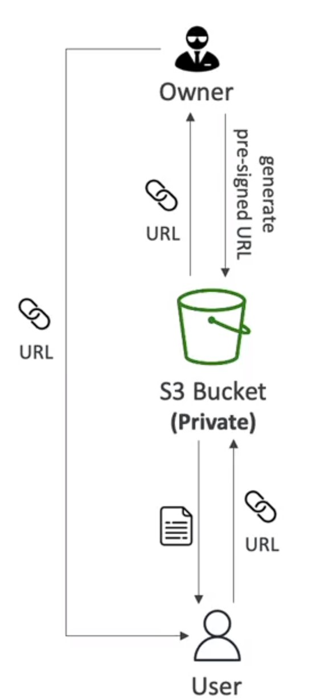
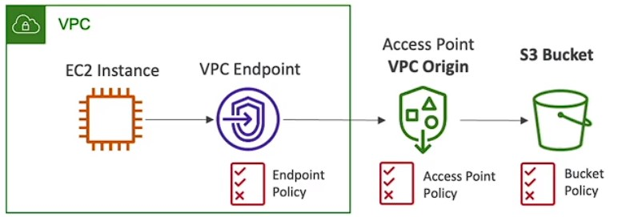
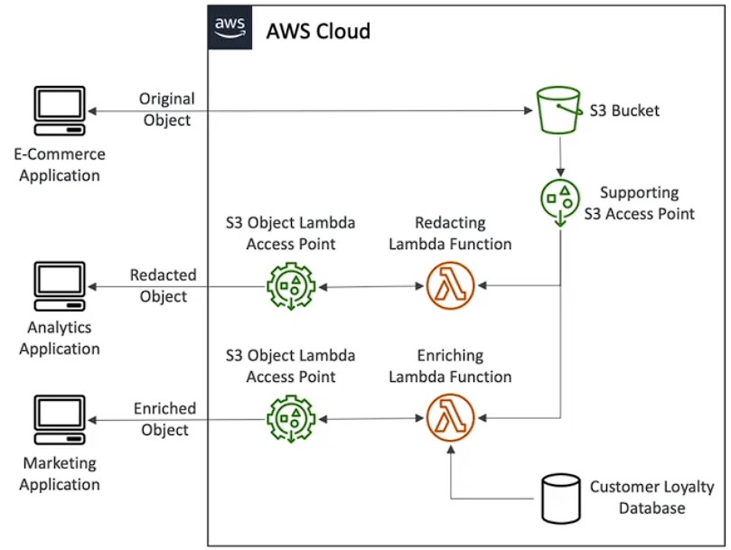

# s3 -  simple storage service
- Backup and storage
- Diaster recovery
- Archive
- Hybid Cloud storage
- Application hosting
- Media Hosting
- Big data and data analytics
- software delivery
- static websites
<br>

## Naming 

- No upper case or underscore
- 3- 63 characterlong
- Not an IP
- Must start with lowercase letter or number
- Must not start wiht prefix xn- 
- must not end wiht suffix - s3alisa
<br>

## objects(files)
-  objects are contents of the body
-  max obj size is 500TB
-  If uploading size is more than 5GM use "*multi-part upload*"
<br>

## Key 
- object have a key
- Key is the full path i.e prefix+object name
  - s3://my-bucket/*myfile.txt* 
  - s3://my-bucket/*myfolder1/another_folder/myfile.txt*
<br> 
<br>
 
- Key is compose of *prefix+object* name
- No concept of *directories* within buckets
- **Key are just very long names that contain slashes("/")**
<br>
  

## Metadata
- lsit of text key/value pairs - system or user data

<br>

## Tags 
-  Unicode key/value pair - up to 10 useful for security/lifecycle
<br>

## VersionID 
-  If versioning is enabled
<br>

# Amazon s3 - Security 

- **User-Based**
  - IAM Policies — which API calls should be allowed for a specific user from IAM
  - user access to s3 - IAM permission
  - 
  
<br>

---

<br>

- **Resource-Based**
  - Bucket Policies — bucket wide rules from the S3 console - allows cross account
  - Object Access Control List (ACL) — finer grain (can be disabled)
  - Bucket Access Control List (ACL) — less common (can be disabled)
  - public access - use bucket policy
  - 
<br> 
<br>
  
- Note: an IAM principal can access an S3 object if
    - The user IAM permissions ALLOW it OR the resource policy ALLOWS it
    - AND there's no explicit DENY
 <br>

<br>

- **Encryption**: Encrypt objects in Amazon S3 using encryption keys
 <br> 
<br>
  

## S3 Bucket Policies
- **JSON based policies**
  - Resources: buckets and objects
  - Effect: Allow / Deny
  - Actions: Set of API to Allow or Deny
  - Principal: The account or user to apply the
  <br>

 <br>

- **Use S3 bucket for policy to:**
  - Grant public access to the bucket
  - Force objects to be encrypted at upload
  - Grant acces to another account
<br>

<br>
  

 # s3- versioning

- To track the changes to the object you upload and roll back if needed 
- If you update an existing file than a new version will be created

- Only file you upload after versioning will have an versioning ID old file will null

- If you delete a file that has versioning enable a delete marker will be placed,by deleting the delete marker you can restore the file

# S3 - replication asynchronous 

- To replicate the bucket objects you need to enable versioning

- If there are objects already in the beginning before replication is enabled you can replicate it by selecting the batch operations

- there are two types of replication
 - CRR cross region replication 
 - SRR same region replication

- An IAM role with correct permission should be created to enable replication

- Helpful for prod and test environments

# S3 - Features

- Highly available 99.99 only 57min of 


# S3 Security

## Amazon S3 — Object Encryption
* You can encrypt objects in S3 buckets using one of 4 methods
* **Server-Side Encryption (SSE)**
    * Server-Side Encryption with Amazon S3-Managed Keys (SSE-S3) — Enabled by Default
    * Encryption using keys handled, managed, and owned by AWS
    * Object is encrypted server-side
    * Encryption type is AES-256
    * Must set header "AES256"
    * 
* Enabled by default for new buckets & new obiects
  
  <br>

* **Encrypts S3 objects using keys handled, managed, and owned by AWS**
  * Server-Side Encryption with KMS Keys stored in AWS KMS (SSE-KMS)
    * Leverage AWS Key Management Service (AWS KMS) to manage encryption keys
    * KMS advantages: user control + audit key usage using CloudTrail
    * Object is encrypted server side
    * Must set header nx-amz-server-side-encryption": "aws:kms"
    * 
  
  <br>

    ```json
      {
      "Version": "2012-10-17",
      "Id": "PutObjPolicy",
      "Statement": [{
        "Sid": "DenyObjectsThatAreNotSSEKMS",
        "Principal": "*",
        "Effect": "Deny",
        "Action": "s3:PutObject",
        "Resource": "arn:aws:s3:::DOC-EXAMPLE-BUCKET/*",
        "Condition": {
          "Null": {
            "s3:x-amz-server-side-encryption-aws-kms-key-id": "true"
          }
        }
      }]
      }
    ```
  <br>

  * **AWS:KMS LIMITATION:**
    *  If you use SSE-KMS, you may be impacted by the KMS limits
    * When you upload, it calls the GenerateDataKey KMS API
    * When you download, it calls the Decrypt
    KMS API
    * Count towards the KMS quota per second (5500, 10000, 30000 req/s based on region)
    * You can request a quota increase using the Service Quotas Console
<br>
    <br> 

* **Server-Side Encryption with Customer-Provided Keys (SSE-C)**
  * When you want to manage your own encryption keys
  * Server-Side Encryption using keys fully managed by the customer outside of AWS
  * Amazon S3 does NOT store the encryption key you provide
  * HTTPS must be used
  * Encryption key must provided in HTTP headers, for every HTTP request made
  * 

<br>

* **Client-Side Encryption**
  * Use client libraries such as Amazon S3 Client-Side Encryption Library
  * Clients must encrypt data themselves before sending to Amazon S3
  * Clients must decrypt data themselves when retrieving from Amazon S3
  * Customer fully manages the keys and encryption cycle
* Its important to understand which ones are for which situations for the exam

    ```json
      {
      "Version": "2012-10-17",
      "Id": "PutObjPolicy",
      "Statement": [{
        "Sid": "DenyObjectsThatAreNotSSEKMS",
        "Principal": "*",
        "Effect": "Deny",
        "Action": "s3:PutObject",
        "Resource": "arn:aws:s3:::DOC-EXAMPLE-BUCKET/*",
        "Condition": {
          "Null": {
            "s3:x-amz-server-side-encryption-customer-algorithm": "true"
          }
        }
      }]
      }
    ```


## S3 - Encryption in transit (SSL/TLS)

* Encryption in flight is also called SSIJTLS
* Amazon S3 exposes two endpoints:
  * HTTP Endpoint — non encrypted
  * HTTPS Endpoint — encryption in flight
* HTTPS is recommended
* HTTPS is mandatory for SSE-C
* Most clients would use the HTTPS endpoint by default

### You can enforces Encryption in Transit by using a condition aws:SecureTransport in s3  resources based policy

  ```json
  {
      "Version": "2012-10-17",
      "Statement": [{
          "Sid": "RestrictToTLSRequestsOnly",
          "Action": "s3:*",
          "Effect": "Deny",
          "Resource": [
              "arn:aws:s3:::mybucket",
              "arn:aws:s3:::mybucket/*"
          ],
          "Condition": {
              "Bool": {
                  "aws:SecureTransport": "false"
              }
          },
          "Principal": "*"
      }]
  }
  ```

## Amazon S3 - CORS

* Cross-Origin Resource Sharing (CORS)
* Origin = scheme (protocol) + host (domain) + port
  * example: https://www.example.com (implied port is 443 for HITPS, 80 for HTTP)
* Web Browser based mechanism to allow requests to other origins while visiting the main origin
* Same origin: http://example.com/appl & http://example.com/app2
* Different origins: http://www.example.com & http://other.example.com
* The requests won't be fulfilled unless the other origin allows for the requests, using CORS Headers (example: Access-Control-Allow-Origin)
* 
* Ifa client makes a cross-origin request on our S3 bucket, we need to enable
the correct CORS headers
* It's a popular exam question
* You can allow for a specific origin or for * (all origins)
*  
* If the index.html has an image that is pointing to assests bucket unless the assests bucket policy allows calls from the html bucket through Access-Control-Allow-Origin to read or get you cant access the host bucket(one recieves the call) from origin bucket(one making the call)

### In one line CORS is a web browser security that allow you to enable images or assests or files being retrives form one s3 bucket in case the request is originating form another origin 

```json
[
    {
        "AllowedHeaders": [
            "*"
        ],
        "AllowedMethods": [
            "GET"
        ],
        "AllowedOrigins": [
            "http://www.origin.com"
        ],
        "ExposeHeaders": [],
        "MaxAgeSeconds": 3000
    }
]
```

### Amazon S3 — MFA Delete

* MFA (Multi-FactorAuthentication) — force users to generate a code on a device (usually a mobile phone or hardware) before doing important operations on S3
* MFA will be required to:
  * Permanently delete an object version
  * Suspend Versioning on the bucket
* MFA won't be required to:
  * Enable Versioning
  * List deleted versions
* example MFA's:
  * Google Authenticator
  * MFA Hardware Device
* To use MFA Delete, Versioning must be enabled on the bucket
* Only the bucket owner (root account) can enable/disable MFA Delete
* you cant enable MFA from console you can use CLI,SDK's or REST API's

### S3 Access Logs

* For audit purpose, you may want to log all access to S3 buckets
* Any request made to S3, from any account, authorized or denied, will be logged into another S3 bucket
* That data can be analyzed using data analysis tools...
* The target logging bucket must be in the same AWS region
* The log format is at: https://docs.aws.amazon.com/AmazonS3/latestJdev/LogFormat.html

### Amazon S3 — Pre-Signed URLs
* Generate pre-signed URLs using the S3 Console,AWS CLI or SDK
* **URL Expiration**
  * S3 Console— I min up to 720 mins (12 hours)
  * AWS CLI — configure expiration with —expires-in parameter in seconds (default 3600 secs, max. 604800 secs ~ 168 hours)
* Users given a pre-signed URL inherit the permissions of the user that generated the URL for GET / PUT
* Examples:
  * Allow only logged-in users to download a premium video from your S3
  bucket
  * Allow an ever-changing list of users to download files by generating URLs dynamically
  * Allow temporarily a user to upload a file to a precise location in your S3 bucket
  
  * 

## Amazon S3 - Access Points

* Access Points simplify security management for S3 Buckets
* Each Access Point has:
  * its own DNS name (Internet Origin orVPC Origin)
  * an access point policy (similar to bucket policy) — manage security at scale
  *  

* S3 -access point - VPC origin
  * We can define the access point to be accessible only from within the VPC
  * You must create a VPC Endpoint to access the Access Point (Gateway or Interface Endpoint)
  * The VPC Endpoint Policy must allow access to the target bucket and Access Point
  * 

## Amazon s3 - object Lambda

* Use AWS Lambda Functions to change the object before it is retrieved by the caller application
* Only one S3 bucket is needed, on top of which we **create S3 Access Point and S3 Object Lambda Access
Points.**
* Use Cases:
  * Redacting personally identifiable information for anarytics or non-production environments.
  * Converting across data formats, such as converting XML to JSON.
  * Resizing and watermarking images on the fly using caller-specific details, such as the user who requested the object
*  