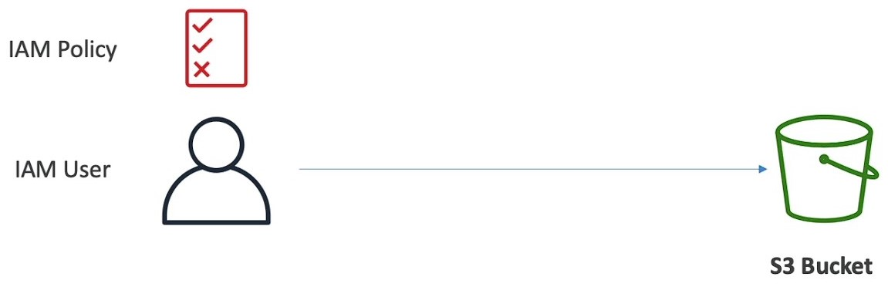

# s3 -  simple storage service
- Backup and storage
- Diaster recovery
- Archive
- Hybid Cloud storage
- Application hosting
- Media Hosting
- Big data and data analytics
- software delivery
- static websites
 

## Naming 

- No upper case or underscore
- 3- 63 characterlong
- Not an IP
- Must start with lowercase letter or number
- Must not start wiht prefix xn- 
- must not end wiht suffix - s3alisa
 

## objects(files)
-  objects are contents of the body
-  max obj size is 500TB
-  If uploading size is more than 5GM use "*multi-part upload*"
 

## Key 
- object have a key
- Key is the full path i.e prefix+object name
  - s3://my-bucket/*myfile.txt* 
  - s3://my-bucket/*myfolder1/another_folder/myfile.txt*
  
 
 
- Key is compose of *prefix+object* name
- No concept of *directories* within buckets
- **Key are just very long names that contain slashes("/")**
 
  

## Metadata
- lsit of text key/value pairs - system or user data

 

## Tags 
-  Unicode key/value pair - up to 10 useful for security/lifecycle
 

## VersionID 
-  If versioning is enabled
 

# Amazon s3 - Security 

- **User-Based**
  - IAM Policies — which API calls should be allowed for a specific user from IAM
  - 
  
 

---

 

- **Resource-Based**
  - Bucket Policies — bucket wide rules from the S3 console - allows cross account
  - Object Access Control List (ACL) — finer grain (can be disabled)
  - Bucket Access Control List (ACL) — less common (can be disabled)
  - 
  
 
  
- Note: an IAM principal can access an S3 object if
    - The user IAM permissions ALLOW it OR the resource policy ALLOWS it
    - AND there's no explicit DENY
  

 

- **Encryption**: Encrypt objects in Amazon S3 using encryption keys
   
 
  

## S3 Bucket Policies
- **JSON based policies**
  - Resources: buckets and objects
  - Effect: Allow / Deny
  - Actions: Set of API to Allow or Deny
  - Principal: The account or user to apply the
   

  

- **Use S3 bucket for policy to:**
  - Grant public access to the bucket
  - Force objects to be encrypted at upload
  - Grant acces to another account
 

 
  

 # s3- versioning

- To track the changes to the object you upload and roll back if needed 
- If you update an existing file than a new version will be created

- Only file you upload after versioning will have an versioning ID old file will null

- If you delete a file that has versioning enable a delete marker will be placed,by deleting the delete marker you can restore the file

# S3 - replication asynchronous 

- To replicate the bucket objects you need to enable versioning

- If there are objects already in the beginning before replication is enabled you can replicate it by selecting the batch operations

- there are two types of replication
 - CRR cross region replication 
 - SRR same region replication

- An IAM role with correct permission should be created to enable replication

- Helpful for prod and test environments

# S3 - Features

- Highly available 99.99 only 57min of 